# piKa - a multimaterial filament buffer solution

---

| 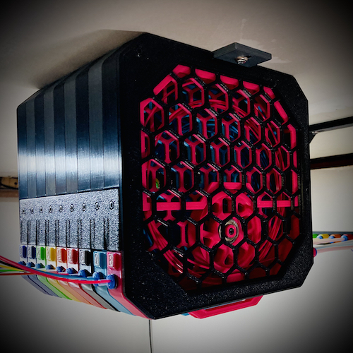 | 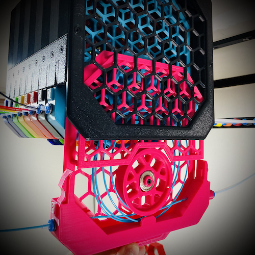 | 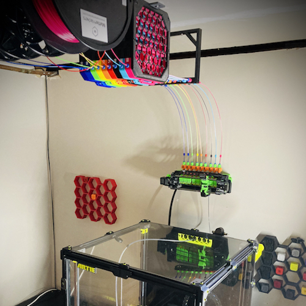 |
| :---: | :---: | :---: |
| |  | |

---

## welcome

thanks for checking out [piKa](#pika), the friendly [ercf](https://github.com/EtteGit/EnragedRabbitProject) filament buffer.

now let's get to it...

* [operation](#operation)
* [how much can I buffer?](#how-much-can-i-buffer)
  + [testing](#testing)
  + [limitations](#limitations)
* [BOM](#bom)
  + [a note on magnets...](#a-note-on-magnets)
  + [m2x8 hex cap self threading screws](#m2x8-hex-cap-self-threading-screws)
* [printing](#printing)
* [assembly](#assembly)
  + [manual](#manual)
  + [array](#array)
  + [buffer segments](#buffer-segments)
  + [tag plates](#tag-plates)
* [mounting](#mounting)
* [pictures](#pictures)
* [why?](#why)
* [piKa?](#pika)
* [credits](#credits)
* [contributing](#contributing)
* [other buffer options](#other-buffer-options)

---

## operation

buffer operation made simple...

[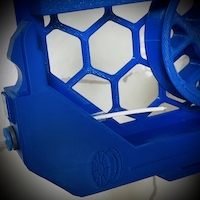](./images/operation-feed.png)  [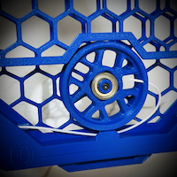](./images/operation-anchor.png)  [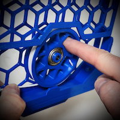](./images/operation-spin.png)  [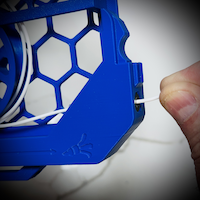](./images/operation-pull.png)

there's also a video of the buffer in action I posted on discord that's worth a look:

- https://discord.com/channels/460117602945990666/708772910956937336/1038298353324273754

the number of people who haven't figured out the spin-the-wheel-with-your-finger method is significantly higher than I would have imagined.

"but how fast and easy is it to load... really?" I hear you cry.  allow satisfied discord user `@ningj V2.2726` to show you:

- https://discord.com/channels/460117602945990666/909743915475816458/1089361904650162266

## how much can I buffer?

my `ercf_calib_ref` is currently `1146.4` and I use 5 loops.

beyond that, my tests indicate the [standard wheel](stl/[a]_buffer-wheel_xN.stl) can successfully buffer ~300mm per loop up to 6 loops:

| loops | buffer capacity |
| :---  | :---            |
| 1     | 300mm           | 
| 2     | 600mm           | 
| 3     | 900mm           | 
| 4     | 1200mm          | 
| 5     | 1500mm          | 
| 6     | 1800mm          | 
| 7+    | not recommended | 

### testing

I've added the [klipper macro](./klipper/pika.cfg) I use to test repeated buffer load/unload cycles, which is a great way to exercise your setup without printing.

***!!! you must remove the bowden from the toolhead before running this macro.  you've been warned !!!***

### limitations

pika performance is steady and reliable up to 6 loops, which should provide more than enough for the vast majority of setups.

at 7+ loops two gremlins start to reveal themselves...

the first gremlin is that the filament begins to be more prone to tangling during or after the load sequence.  experimentation has led me to believe this is mostly due to limitations of the [standard wheel](stl/[a]_buffer-wheel_xN.stl) design.

the second gremlin is more insidious in that the weight of the buffered filament begins to compound - once you load 300mm it takes more push to slosh the next 300mm of filament back and coil it up in the cage.  after around 2000mm or so of filament the ercf gear isn't as successful in pushing all the filament along and the consistency of the buffer process begins to degrade.  

the former problem I'm beginning to solve with a [new wheel concept](https://github.com/geoffrey-young/pika-filament-buffer/tree/v2-wheel-beta/v2-wheel-beta), while no wheel design can counteract the laws of physics governing the latter.  I'm still giving this latter gremlin some thought...

## BOM

here is the hardware you'll need.  hopefully this is a full, accurate list...

| item                                                                     | 3 cart total | 6 cart total | 9 cart total | 12 cart total |
| :---                                                                     | :---         | :---         | :---         | :---          |
| m3x8 (or m3x10)                                                          | 23           | 38           | 53           | 68            |
| m3x8 (or m3x10) flat head                                                | 6            | 12           | 18           | 24            |
| m3x12                                                                    | 3            | 6            | 9            | 12            |
| m3 heatset (standard voron m3 x 5mm x 4mm)                               | 12           | 24           | 36           | 48            |
| [m2x8 self tapping](#m2x8-hex-cap-self-threading-screws)                 | 21           | 42           | 63           | 84            |
| 608 bearing                                                              | 3            | 6            | 9            | 12            |
| ecas connector                                                           | 6            | 12           | 18           | 24            |
| [10x3 disc magnet with 3mm hole](#a-note-on-magnets) (optional)          | 6-12         | 12-24        | 18-36        | 24-48         |
| PTFE/FEP 4mm OD x (2.5mm or 3.0mm ID) tubing                             | variable     | variable     | variable     | variable      |

note that all of the m3x8 screw holes are long enough to accept m3x10

plus mounting hardware if you want to use the bottom bracket to mount the array on something.

the majority of the hardware was selected due to it being common across voron builds, so folks will likely have it just sitting around.  the big exception being the hole magnets...

### a note on magnets...

I used 10x3 disc magnets ~~[from amazon]()~~, which seem to be a moving target. basically, you're looking for 10x3 disc magnets with a 3mm hole in the middle, like these:

magnets with 4mm holes are a little better, but outside of the very first set I ordered I haven't been able to find any.

**just a small wrinkle...** as with the "6x3mm" magnets for the ercf and other voron projects, parts are designed against sizes most commonly provided by suppliers.  in our case, the majority of "10x3mm" hole magnets in the wild are really around 9.5mm in diameter.  as such, piKa parts are designed against this width.

 [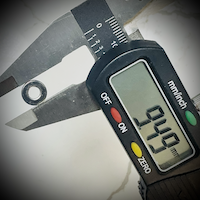](./images/magnet-lies.png)

if you have true 10x3mm magnets they'll be too large for the standard magnet tops and connectors.  the good news is that you now have options.

[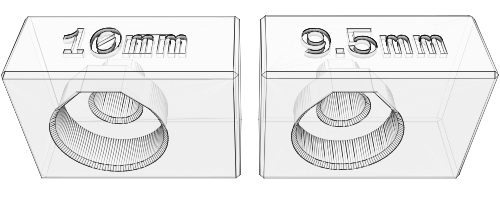](./stl/10mm-magnets/magnet-test-blocks.stl)

after printing the [magnet test blocks](./stl/10mm-magnets/magnet-test-blocks.stl) to verify your fit, the [10mm](./stl/10mm-magnets/) directory has the files you'll need.

### m2x8 hex cap self threading screws

these m2x8 hex cap self threading screws [from amazon](https://www.amazon.com/gp/product/B00YBMRAH4) are really handy, both for this and other voron projects, like klicky.  m2x10 will also work if those are easier to find.  

## printing

a few things to note when printing...

- **the models already oriented for optimal printing**.  no parts have included supports to remove, nor are supports necessary for any part.  if there are overhangs that need support the part is oriented incorrectly.
- due to bending of large parts, you want to **print the bottoms flat so that the latch fit is tight** - you'll only be able to print 1 or two of these at a time.
- conversely, **the tops are designed to be printed upright**, so go ahead and fill your plate.  if you care about a good looking bottom overhang, keep your exterior perimeter fans at 100% and engage them starting on layer 2.
- I used 20% infill on the tops and bottoms in order to keep parts light and plastic use down.  **ymmv**.
- I would suggest printing the latches and bracket using standard voron parameters (40% infill, .2mm layers, 4 perimeters) for added strength.
- the screen with the posts works best with higher temps and lower fan to keep the layers as strong as possible.  early versions had thinner posts, but the current version is a bit more rigid and should be less problematic.
- consider using setting `only_one_perimeter_first_layer` to `true` for the screens, which helps the first layer be a little more sane.  well, in superslicer, anyway.

I printed mine in ABS, and most people do the same.  PLA should be fine, but ymmv...

## assembly

hopefully, y'all find this self explanatory, and can figure it out from the pictures.  basically, we have:

- a series of buffer slot slider thingies
- held together by a frame

that's about it.

the good news is that there's only one way the parts can really go together, and everyone so far has found it relatively straightforward.

and in late breaking news, there's even [a manual](./assembly-manual.pdf)!

feel free to ping me on the [voron discord](https://discord.com/channels/460117602945990666/869236671554682990) in [`#ercf_questions`](https://discord.com/channels/460117602945990666/909743915475816458) if you have issues.  

### manual

and now... [a manual](./assembly-manual.pdf)

[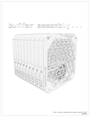](./assembly-manual.pdf)

### array

currently, there are 6, 9, and 12 slot versions.  the only parts that differ depending on the number of slots are the side latches and bottom bracket.

the 9 cart is the most popular, and what I currently run. both the 6 and 12 cart versions have at least one user I've worked through the design with, so I'm confident in the dimensional accuracy. however, if you discover an issue with the sizing just let me know.

| part                                                           | description                                                                                                       | required hardware | 
| :---                                                           | :---                                                                                                              | :---              |
| [`array-front.stl`](stl/array-front.stl)                       | front of array                                                                                                    | m3x8 (or m3x10)   | 
| [`array-front-screen.stl`](stl/array-front-screen.stl)         | screen for front of array                                                                                         | none              | 
| [`array-back.stl`](stl/array-back.stl)                         | back of the array                                                                                                 | m3x8 (or m3x10)   |
| [`array-latch-9a.stl`](stl/array-latch-9a.stl)                 | side latch (stls for 3, 6, and 12 cart versions also provided)                                                    | m3x8 (or m3x10)   |
| [`array-latch-9b.stl`](stl/array-latch-9b.stl)                 | side latch (stls for 3, 6, and 12 cart versions also provided)                                                    | m3x8 (or m3x10)   |
| [`array-bottom-bracket-9.stl`](stl/array-bottom-bracket-9.stl) | bottom bracket (stls for 3, 6, and 12 cart versions also provided)                                                | m3x8 (or m3x10)   |

### buffer segments

one complete buffer is required per cart, so for a nine cart system `_xN` turns in to `_x9` and you print 9 of that piece.

two buffer top configurations are provided:

* [one ecas end and one disc magnet end](stl/[a]_buffer-top-ecas+magnet_xN.stl)
* [two disc magnet ends](stl/[a]_buffer-top-magnet+magnet_xN.stl)

which configuration you choose depends on the needs of your setup.  

please see [the note on magnets](#a-note-on-magnets), and check out the [10mm magnet options](./stl/10mm-magnets/) as required. 

| part                                                                             | description                                                   | required hardware                                        |
| :---                                                                             | :---                                                          | :---                                                     |
| [`buffer-bottom_xN.stl`](stl/buffer-bottom_xN.stl)                               | segment bottom                                                | m3 heatset                                               |
| [`[a]_buffer-top-ecas+magnet_xN.stl`](stl/[a]_buffer-top-ecas+magnet_xN.stl)     | segment top, one side ecas and one side disc magnet connector | ecas, [9.5mm disc magnet](#a-note-on-magnets)            |
| [`[a]_buffer-top-magnet+magnet_xN.stl`](stl/[a]_buffer-top-magnet+magnet_xN.stl) | segment top, both sides disc magnet connector                 | ecas, [9.5mm disc magnet](#a-note-on-magnets)            |
| [`[a]_ecas-to-magnet-end_xN.stl`](stl/[a]_ecas-to-magnet-end_xN.stl)             | if you use either of the magnet tops                          | ecas, [9.5mm disc magnet](#a-note-on-magnets)            |
| [`[a]_buffer-screen-a_xN.stl`](stl/[a]_buffer-screen-a_xN.stl)                   | segment screen for wheel                                      | m3x8 (or m3x10) flat head, m3 heatset                    |
| [`[a]_buffer-screen-b_xN.stl`](stl/[a]_buffer-screen-b_xN.stl)                   | segment top screen                                            | [m2x8 self tapping](#m2x8-hex-cap-self-threading-screws) |
| [`[a]_buffer-bearing-insert_xN.stl`](stl/[a]_buffer-bearing-insert_xN.stl)       | holds the wheel in place                                      | m3x12                                                    |
| [`[a]_buffer-handle_xN.stl`](stl/[a]_buffer-handle_xN.stl)                       | segment handle                                                | m3x8 (or m3x10)                                          |
| [`[a]_buffer-wheel_xN.stl`](stl/[a]_buffer-wheel_xN.stl)                         | wheel                                                         | 608 bearing                                              |

the wheel is (currently) almost exactly the same as the ercp wheel...  however, I strongly suggest *not* using the stock ercf wheel - the pika wheel has a slightly different bearing offset so that it sits next to the screen properly, as well as a hole for loading so you are less likely to cross filament on the wheel.

### tag plates

if you mount your buffer overhead your numbers will be upside down.  you can find upside down tag plates [here](https://github.com/geoffrey-young/3D-Printing/tree/main/models/voron/ercf/upside-down-numbers).

## mounting

in general I'm not a fan of sticking the ercf on my printer - something just makes me think all that extra weight and loose pieces rattling around can't be good for my resonance compensation efforts.

with that in mind, I mount my ercf on the wall at 90 degrees using a french cleat system, which you can find [here](https://github.com/geoffrey-young/3D-Printing/tree/main/models/voron/ercf/mounts/ercf-french-cleat).

the 90 degree mounting created some challenges accessing the filament block ecas connectors, so I made [an extension](https://github.com/geoffrey-young/3D-Printing/tree/main/models/voron/ercf/extender) to help.

a magnetic bowden "bridge" (plus some springs) keeps my bowden tubes straight, clear, and managed.  available [here](https://github.com/geoffrey-young/3D-Printing/tree/main/models/voron/ercf/mounts/bridge).

## pictures

some reference photos, videos, etc

| artie `v2.1650` | | |
| :--- | :--- | :--- |
|  | [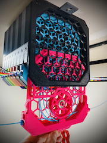](./images/buffer-wheel-1.jpg) | [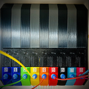](./images/buffer-2.jpg) |
| [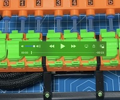](https://discord.com/channels/460117602945990666/708772910956937336/1038298353324273754) | [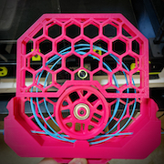](./images/buffer-wheel-2.jpg) | [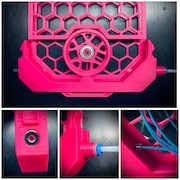](./images/path.jpg) |
| [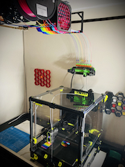](./images/artie.jpg) | [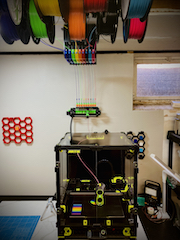](./images/artie-2.jpg) |  |

| other users on discord | | |
| :--- | :--- | :--- |
| [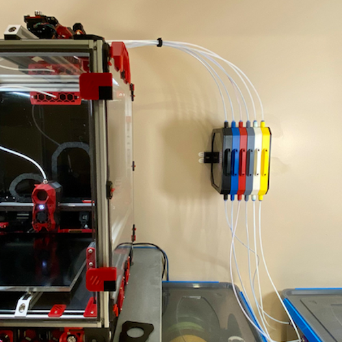](./images/user/ningj.png) | [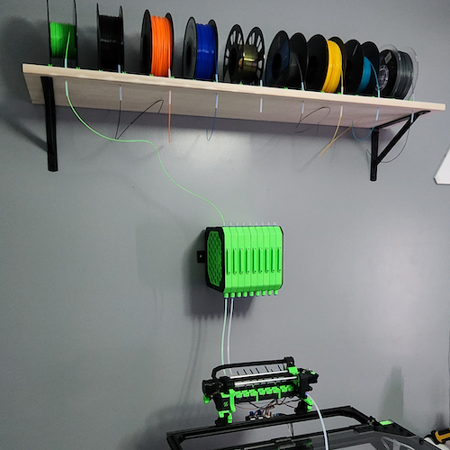](./images/user/campapalooza.jpg) | [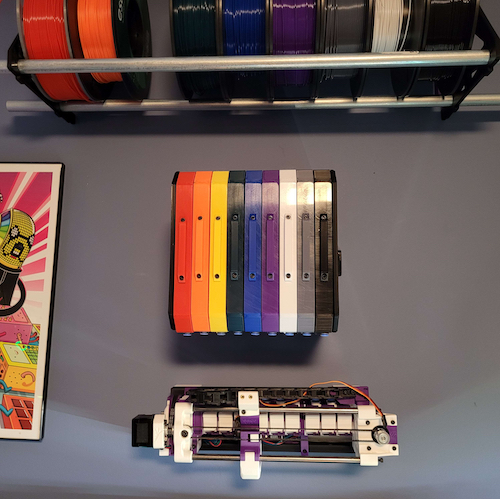](./images/user/user-1.png) |
| [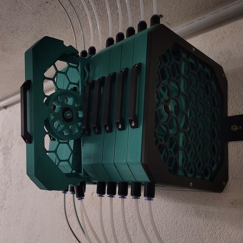](./images/user/user-2.jpg) | [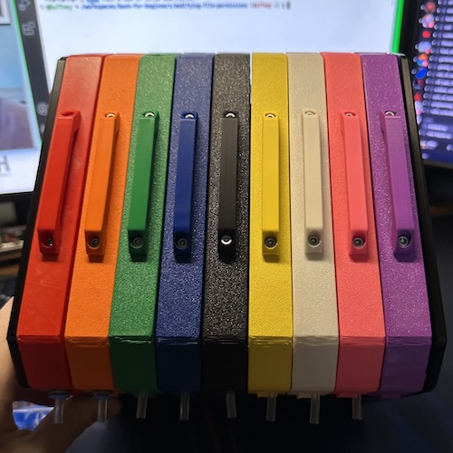](./images/user/user-3.jpg) | |

pull requests against the [current development branch](#contributing) with your (single 500x500px) picture added to `images/user/` most welcome.

## why?

filament buffers are hard™

I didn't realize how hard until I ventured down this path.

I started like most do, and loyally printed some [ercf carrot patch](https://github.com/EtteGit/EnragedRabbitProject/tree/main/Carrot_Patch) units.  space limitations required me to mount them overhead, which is where things started to go sideways - every time I needed to put in new filament I had to find a chair and fsck around with the confined carrot patch space, sharp edges, filament whiplash, and whatnot - all overhead - until my shoulders hurt, cursing the entire time.  I figured there had to be a better way...  

it turns out, there really wasn't...  at least not at the time.  since then, the community has been kind enough to generate a few [different buffer options](#other-buffer-options), each with its unique set of benefits and drawbacks depending on your needs, setup, and tolerance.  all of them are better than the original ercp, imho, which is good for everyone.  however, I'm of the opinion that they all still have drawbacks, leaving us still chasing the platonic ideal filament buffer solution...

still, way back then all I wanted was a lightning-fast, super-simple, overhead-mounted, expletive-free, wheel-based, wicked-dependable filament buffer solution.  how hard could it be?

this thing here is where I ended up.

honestly, I'm surprised it actually worked... but it really does, and my experience has been frustration free ever since.  others on discord seem to have similarly joyful experiences with it as well, so I guess I'm on to something.

## piKa?

### ***in chemistry...***

a [buffer](https://en.wikipedia.org/wiki/Buffer_solution) is a solution specifically designed to be resistant to changes in pH, allowing a reaction to continue in balance even when ideal conditions are threatened.  the most effective buffers  - those with the greatest capacity to absorb change - are created using an acid whose **p**___Ka___ (acid dissociation constant) is equal to the desired pH.  choosing an acid with the wrong **p**___Ka___ can mean disaster.

**p**___Ka___ is crucial to buffer efficacy

### ***in taxonomy...***

three members make up the order [Lagomorpha](https://en.wikipedia.org/wiki/Lagomorpha): rabbits, hares… and pikas

pretty cool little creatures, worth getting to know.

### ***in multimaterial 3d printing...***

we have a [rabbit](https://github.com/EtteGit/EnragedRabbitProject), and a [hare](https://github.com/moggieuk/Happy-Hare), and now... a pika

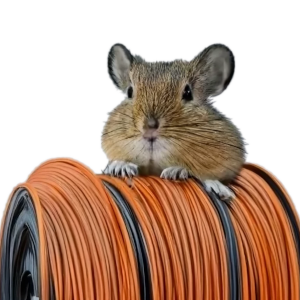

buffers, solutions, p*Ka*... the name just seemed to come together for a recovering chemist.

## credits

- the entire concept here started after seeing [this mmu buffer on printables.com](https://www.printables.com/model/30811-mmu-slot-buffer).  while my work isn't really a mod of that (I modeled everything myself from scratch), I did copy the latch concept nearly... verbatim?  I'm sure there's a word for it.  anyway, the latch works really well, and needless to say I couldn't have figured a mechanism like that on my own.  this project owes sincere credit and gratitude to all the work and effort over there.  many thanks!

- all the fittings and cutouts - ecas and m3 holes, bridging, etc - were taken directly from either the [ercf project](https://github.com/EtteGit/EnragedRabbitProject) or the [voron 2.4 project](https://github.com/VoronDesign/Voron-2/).  since I use blender and don't cad, I really appreciate all the community work that has gone into getting those measurements and fit tricks just right.  kudos to team voron, be they enraged or not.

- the buffer wheel is taken right from [ercf project](https://github.com/EtteGit/EnragedRabbitProject).  no need to reinvent the wheel...

- [deepfriedhero](https://dfh.fm), [west3d](https://west3d.com), and [fabreeko](https://www.fabreeko.com) for consistently fantastic parts and service

- I'm super grateful for some early beta testers, who provided really valuable feedback:
  - `@TheTechRunner V2.1453 V0.1556`
  - `@ningj V2.2726`
  - `@ZChem V2.5299`
  - `@SilentMuse V2.3841`
  - `@Imburr VT.959`
  - `@xF4m3 V2.3687`

- probably others - if you feel left out let me know :)

## contributing

pull requests against [the `dev` branch](https://github.com/geoffrey-young/pika-filament-buffer/tree/v2-wheel-beta/) more than welcome.  feel free to dm me over in discord to discuss something first.

be sure to read the [LICENSE](./LICENSE) and mentally agree with it.  please don't make me add license acknowledgement and sign-off overhead to the project - we're all just after a kinder buffer experience so we can get on with printing, so let's just focus on that, ok?

## other buffer options

some other community buffers that may suit your needs:

- [carrot quiver](https://github.com/SkiBikePrint/ERCF_Mods/tree/main/Carrot_Quiver_Buffer)
- [stern wheeler](https://www.printables.com/model/472316-stern-wheeler)
- [cotton tail](https://github.com/Enraged-Rabbit-Community/ERCF_v2/blob/master/Recommended_Options/ERCT_Buffer)

I suggest asking on discord about these other buffers and their strengths and weaknesses and decide what buffer is best for your situation.

