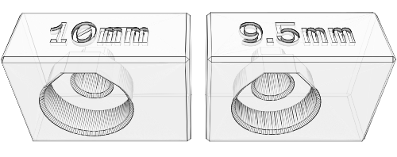

# 10x3mm magnet support

as discussed in [a note on magnets...](../../README.md#a-note-on-magnets) in the [README](../../README.md), true 10x3mm disc magnets are a rare find in the wild.  however, if you happen to get some below are the files you'll need.

please print the [disc magnet test blocks](./magnet-test-blocks.stl) and test fit your magnets before printing actual parts.

---

| part                                                                                                    | description                                                          |
| :---                                                                                                    | :---                                                                 |
| [`[a]_10mm-buffer-top-ecas+magnet_xN.stl`](stl/10mm-magnets/[a]_10mm-buffer-top-ecas+magnet_xN.stl)     | segment top, one side ecas and one side 10x3mm disc magnet connector |
| [`[a]_10mm-buffer-top-magnet+magnet_xN.stl`](stl/10mm-magnets/[a]_10mm-buffer-top-magnet+magnet_xN.stl) | segment top, both sides 10x3mm disc magnet connector                 |
| [`[a]_10mm-ecas-to-magnet-end_xN.stl`](stl/10mm-magnets/[a]_10mm-ecas-to-magnet-end_xN.stl)             | if you use either of the magnet tops                                 |
