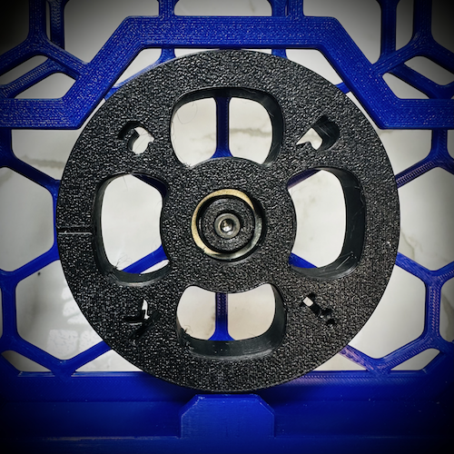
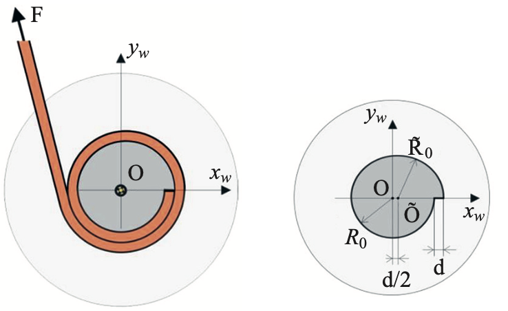

# v2 wheel beta

it's a beta.  you've been warned.

---

## what's different?

### the wheel

the beta wheel has a few features that hope to make a difference in our specific application:

| feature      | (potential) impact                                                                                                                                                                      |
| :---         | :---                                                                                                                                                                                    |
| weight       | the wheel is ~1g lighter than the stock wheel when sliced identically.  a lighter wheel is easier to move, reducing system friction                                                     |
| drum shape   | use of a [two-cylinder drum](./JS0q4v-jom_v35_1_131.pdf) smooths winding/unwinding motions for more uniform system tension                                                              |
| drum width   | more usable width on the drum results in less filament overlap for the same number of loops, reducing both friction and tangles                                                         |
| contact area | using the screen itself to guide filament on the wheel removes an overhang, which in turn reduces the surface area of the wheel in potential contact with the screen, reducing friction | 

### the bearing insert

since the bearing now faces the screen, if the bearing isn't fully seated it leaves a gap between the screen and wheel that we don't want.

as such, the bearing insert is a bit longer, the length serving as a visual and mental cue:

**NOTE: if the bearing insert is flush with the front of the wheel or recessed _your bearing isn't fully seated!_**

when the bearing is properly seated the insert should be proud of the front of the wheel by a single 0.2mm layer

### the buffer tops

the beta buffer tops experient with altering the ptfe path to position the filament for smoother ingress to and egress from the wheel.  the tradeoff is a slightly curved path through the buffer ends.  we'll see how it works out

## background...

the pika buffer project started with my ercp frustration, but as with any open source project it still made sense to copy over the things that worked.  and who reinvents the wheel, right?

life progressed, and pika users started asking for more buffering capacity - up to 2600mm!  the most obvious way to add extra capacity was to make the buffer itself larger, but something about changing the aesthetic of my nice compact little buffer was holding me back, and I got thinking about the wheel...

well, there are plenty of people who [reinvent the wheel](https://en.wikipedia.org/wiki/Shark_Wheel), which got me thinking about the limitations of the stock ercp wheel, and what could be done to improve it.  the thought driving me was this:

- *there isn't a lot of space for the filament to sit next to itself, as the channel is very narrow in the flat center due to the angled overhangs... would an area wide enough for all loops to sit next to eachother lead to fewer tangles?  less friction?*
- *given enough room on the wheel, what is the maximum number of loops and filament that can be buffered without changing overall design?*
- *each diameter of the wheel is space in the buffer that isn't actually buffering the reverse bowden.  can the wheel be smaller?*
- *has anyone actually studied the mechanics of all of this?*

it turns out, there are scientists who study this stuff.

[one of the studies](./JS0q4v-jom_v35_1_131.pdf) I found investigated coiling and uncoiling effects in commercial cable systems, and demonstrated that a two-cylinder drum like this resulted in a more uniform system:

so I started there and tried to answer my questions with different designs and experimentation.

## next steps

I've documented most of what I discovered [in the base README](../README.md#how-much-can-i-buffer), and had a few people besides me experiment with the new wheel with a decent degree of success.  now it's time for a slightly wider audience.

remember: it's a beta, so there are no guarantees here.  if you use it on a 500 hour print and things go awry, well...

## thanks

many thanks to the early beta testers:

- `@ningj V2.2726`
- `@Imburr VT.959`
- `@SilentMuse V2.3841`

---

now that you're at the bottom, I'm sure you read all of that and are deserving of the beta files...

| `r1` |                                                                                                                 |
| :--- | :---                                                                                                            |
|      | [`wheel-beta-r1.stl`](./stl/r1/wheel-beta-r1.stl)                                                               |
|      | [`[a]_buffer-bearing-insert_xN-beta-r1.stl`](./stl/r1/[a]_buffer-bearing-insert_xN-beta-r1.stl)                 |
|      | [`[a]_buffer-top-ecas+magnet_xN-beta-r1.stl`](./stl/r1/[a]_buffer-top-ecas+magnet_xN-beta-r1.stl)               |
|      | [`[a]_buffer-top-magnet+magnet_xN-beta-r1.stl`](./stl/r1/[a]_buffer-top-magnet+magnet_xN-beta-r1.stl)           |
|      | [`[a]_10mm-buffer-top-ecas+magnet_xN-beta-r1.stl`](./stl/r1/[a]_10mm-buffer-top-ecas+magnet_xN-beta-r1.stl)     |
|      | [`[a]_10mm-buffer-top-magnet+magnet_xN-beta-r1.stl`](./stl/r1/[a]_10mm-buffer-top-magnet+magnet_xN-beta-r1.stl) |

---
